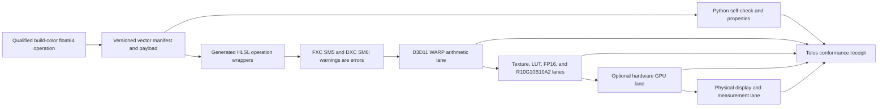

# Build Color Cross-Language Conformance Spine Design

**Date:** 2026-07-10
**Status:** Proposed; awaiting review
**Primary owner:** build-color
**Consumers:** Calibrate Pro, RAW, Project Telos, and the artistic engine

## Objective

Turn build-color into a qualified, versioned CPU reference for explicitly
approved color operations, then drive the same conformance vectors through
Calibrate Pro, generated HLSL wrappers, a D3D11 WARP runner, packed texture/LUT
lanes, optional hardware GPUs, and eventually measured displays.

“Qualified” is per operation and version. A passing package test suite does not
make every function a numerical oracle. Unqualified functions remain usable as
experimental utilities but cannot generate golden vectors or standards claims.

## Verified Starting Point

The 2026-07-10 audit inspected:

- build-color commit `96560ee`;
- protected RAW commit `b6d8ad6`;
- Community Shaders `dev@0a81516`;
- RenoDX `main@8efffa2`.

The focused build-color suite passed 277 tests. Independent probes still found:

1. `build_color.tonemap.uchimura` falls from approximately `0.219999` at
   input `0.219999` to `0.088460` at `0.22`. The existing coarse monotonic test
   steps over the branch discontinuity.
2. `build_color.tonemap.bt2390_eetf` for a 4000-to-1000 cd/m² mapping becomes
   decreasing above about 1996 cd/m², reaches about 1995.88 cd/m², then falls to
   about 1000 cd/m² at the source peak. The current test permits decreasing
   output.
3. The ACEScg/AP1 matrix is D60-derived but labeled D65; the conversion accepts
   D65 sRGB without chromatic adaptation. A loose test tolerance masks the white
   mismatch.
4. The function named `hlg_eotf` implements an inverse OETF-shaped operation
   without an explicit display system gamma/peak model. Its name and domain are
   not yet a safe standard contract.
5. ICtCp has a forward path without a tested inverse.
6. `oklab_chroma_reduce(..., target_gamut=...)` ignores `target_gamut` and
   evaluates only linear sRGB.
7. `.cube` `DOMAIN_MIN/MAX` values are applied to output samples and discarded,
   while the LUT object retains no input/output color contract, shaper,
   interpolation, precision, or provenance.

The same audit found a source-of-truth split in RAW: its registered runtime
`ColorPipeline` compiles an embedded shader lacking tone mapping, LUT sampling,
and output encoding even though the default stage mask includes tone mapping.
The richer external `Shaders/ColorPipeline.hlsl` is not the shader registered by
that path. A separate RAW HDR path PQ-encodes without a proved BT.709-to-BT.2020
step. These are static findings and require executable conformance tests before
runtime claims.

## Scope

### In scope

- Per-operation qualification status and provenance.
- A typed color-signal and transform contract.
- Versioned JSON manifests plus compact binary payloads for large vector sets.
- Independent known values, boundary/adjacent values, dense properties, and
  deterministic low-discrepancy samples.
- Python float64 reference and expected float32/float16/packed representations.
- Generated HLSL operation wrappers built with FXC SM5 and DXC SM6.
- Headless D3D11 WARP arithmetic, texture, LUT, and packed-format lanes.
- Machine-readable receipts, bytecode hashes, compiler diagnostics, and failure
  captures.
- Clean-room transfer of behavioral failures from protected/GPL sources.

### Out of scope

- Treating WARP as proof of Windows HDR presentation, metadata, vendor-driver,
  monitor, or instrument behavior.
- Copying protected, decompiled, GPL, or license-incompatible implementation.
- Automatically qualifying every existing build-color operator.
- Physical display certification.
- Performance claims based only on WARP.

## Qualification States

Each exported operation has one state:

- `qualified` — contract, provenance, independent vectors, properties, and all
  required backends pass;
- `cpu_qualified` — float64/float32 reference is qualified but GPU/resource lanes
  are not yet complete;
- `provisional` — useful implementation with incomplete independent evidence;
- `rejected` — a known correctness/contract defect prevents authoritative use;
- `deprecated` — retained only as a compatibility delegate to another qualified
  operation.

The package API and generated documentation expose the state. A vector generator
refuses to emit golden expectations from a provisional or rejected operation.

Initial audit state:

| Operation/surface | Initial state | Blocking evidence |
|---|---|---|
| Exact piecewise sRGB encode/decode | provisional | Needs independent breakpoint/adjacent vectors and GPU lane |
| PQ encode/decode | provisional | Needs pinned BT.2100/ST 2084 anchors and duplicate-path retirement |
| HLG operations | rejected for conformance | Ambiguous naming/domain and incomplete display model |
| Uchimura | rejected | Branch discontinuity at 0.22 |
| BT.2390 EETF | rejected | Decreasing 4000→1000-nit mapping |
| ACEScg conversion | rejected | AP1/D60 labeled/used as D65 without adaptation |
| ICtCp | provisional | Missing tested inverse and independent vectors |
| Oklab gamut reduction | provisional | Target gamut parameter ignored |
| `.cube`/CLF LUT model | provisional | Domain and color-contract semantics incomplete |

## Typed Contracts

### Color signal

Every operation declares:

```text
ColorSignalDescriptor
  domain: scene_linear | display_linear | encoded | appearance
  primaries: named revision or explicit xy
  white_point: named revision or explicit xy
  transfer: linear | srgb | gamma | pq | hlg | named custom
  luminance: relative(scale, reference_white) | absolute_cd_m2
  range: full | limited(code_min, code_max)
  precision: float64 | float32 | float16 | integer(bit_depth)
  alpha: none | straight | premultiplied
  provenance: standard/source ID and revision
```

No conformance edge accepts an untyped RGB tuple. Windows scRGB `1.0 = 80
cd/m²`, BT.2100 FP16 reference white, UI/graphics white, scene diffuse white,
mastering peak, target peak, reported display peak, and measured peak are
distinct values.

### Transform

```text
TransformDescriptor
  operation_id and semantic version
  input_descriptor
  output_descriptor
  parameter schema and units
  invalid/negative/over-range/NaN/Inf policy
  clipping and alpha policy
  normative or algorithm source provenance
  qualification state
```

### LUT

```text
LUTDescriptor
  lattice dimensions and channel order
  input and output ColorSignalDescriptor
  DOMAIN_MIN/MAX as input sampling domain
  optional shaper and its contract
  interpolation: trilinear | tetrahedral | declared other
  storage precision and quantization
  alpha policy
  content hash and provenance
```

## Vector Manifest

The canonical manifest records:

```text
schema version
vector-set ID/version/hash
generator commit and dependency lock
operation and transform descriptor
case ID and category
inputs and parameters
float64 expected output
expected float32 rounding
optional expected float16/packed bits
absolute, relative, ULP, and optional perceptual tolerances per backend
source/reference ID, revision, page/table/section when permitted
expected status for negative, over-range, NaN, and infinity
```

Large deterministic samples use a content-addressed binary payload referenced by
the JSON manifest. Serialization is canonical and reproducible.

## Initial Vector Corpus

1. Transfer-function breakpoints and adjacent representable values.
2. PQ anchors at 0, 80, 100, 203, 1000, 4000, and 10000 cd/m², plus 10/12-bit
   full- and narrow-range code cases.
3. HLG source/display cases only after the OETF, inverse OETF, OOTF, EOTF,
   system gamma, reference white, peak, and viewing assumptions are separated.
4. Matrix basis vectors, neutral whites, primaries, saturated colors, and
   deterministic low-discrepancy samples.
5. D65↔D60 chromatic adaptation and AP1/ACEScg white invariants.
6. Tone-map knots with adaptive sampling around every branch plus dense
   monotonicity, continuity, finite-output, black, and peak constraints.
7. LUT corners, axes, center texels, half-texel boundaries, channel ordering,
   trilinear/tetrahedral interpolation, shapers, and non-unit domains.
8. R32F oracle values followed by FP16, R10G10B10A2, and RGBA8 quantization.
9. Deterministic dither seeds, time/frame freezing, and quantization boundaries.
10. Pathological negative, over-range, NaN, infinity, alpha, and denormal cases
    with explicit expected policy.

Roundtrip tests are supporting properties, never the only oracle; mutually wrong
forward and inverse functions can roundtrip perfectly.

## Executable Pipeline



### Python reference lane

- Executes float64 known-value cases.
- Computes declared float32/float16 representations.
- Runs breakpoint-adjacent and dense property tests.
- Verifies manifest/payload hashes and deterministic regeneration.
- Prevents a rejected/provisional function from generating qualified vectors.

### HLSL/compiler lane

- Generates small wrappers from operation descriptors rather than copying a
  product shader.
- Builds every declared permutation with FXC SM5 and DXC SM6.
- Treats warnings as errors.
- Records source hash, command line, compiler version, bytecode hash, reflection,
  and assembly/disassembly when available.
- Compares product shader artifacts to the same operation/version receipts.

### WARP arithmetic lane

- Creates a headless D3D11 WARP device.
- Uses structured input/output buffers for pure arithmetic.
- Reads back R32F/RGBA32F staging buffers without image conversion.
- Reports per-channel absolute, relative, ULP, RMS, maximum, and optional
  perceptual errors.
- Preserves failing raw values and case IDs.

### WARP resource lane

- Exercises texture sampling, half-texel positions, trilinear/tetrahedral LUTs,
  shapers, channel order, alpha, and address modes.
- Separately validates FP16, R10G10B10A2, and RGBA8 packing/quantization.
- Freezes dither seed, frame/time, and any stochastic state.

An optional hardware lane reuses the same vectors and receipts. Hardware results
can reveal vendor/compiler differences but do not replace the WARP or CPU lane.

## RAW and Product Source-of-Truth Rule

A runtime feature cannot keep a richer external shader and a different embedded
shader as independent sources of truth. RAW must generate/embed one audited
artifact or load one packaged artifact whose hash is present in the conformance
receipt. The exact shader shipped/registered at runtime is the shader tested.

The HDR output contract requires, in order:

```text
declared scene/working primaries
  -> declared gamut/white-point transform
  -> display mapping/tone mapping
  -> BT.2020 for HDR10 transport
  -> PQ encoding
  -> declared swapchain color space and metadata behavior
```

Scene/UI paths, diffuse/graphics white, target/measured peak, and output
encoding remain separate. Multiple RAW output systems (`ColorPipeline` and
`ToneMapManager`) require mutual exclusion or an explicit, tested composition
order.

## Provenance and Clean-Room Boundary

Each primitive is classified as:

- `standard` — independently implemented from a pinned standard/recommendation;
- `first_party` — authored and qualified in build-color;
- `permissive_attributed` — compatible public implementation with attribution;
- `gpl_behavior_only` — architecture/failure/test behavior, no copied source;
- `protected_behavior_only` — observed behavior/black-box vector only;
- `inference` — stated hypothesis awaiting evidence.

RenoDX is MIT in the audited mirror and can supply attributed permissive
implementation after review. Community Shaders is GPL-family and supplies
behavioral architecture/test requirements for a proprietary clean-room lane.
Protected RAW and decompiled material supply only observed behavior, failure
cases, and black-box vectors. RAW's current AGPL/commercial license and stale MIT
lineage statements must be reconciled before any reuse claim.

## Verification Gates

1. Schema/canonical-serialization tests.
2. Independent known-value tests; no self-generated expected values alone.
3. Adjacent-float and adaptive branch sampling.
4. Dense monotonicity, continuity, boundedness, finiteness, endpoint, and white
   invariants.
5. Roundtrip and inverse tests as secondary properties.
6. Exact rebuild of the vector manifest/payload hash.
7. FXC/DXC warning-free compilation and receipted bytecode.
8. WARP arithmetic and resource lanes within declared tolerances.
9. Product artifact hash matches the conformance-tested shader/library artifact.
10. License/provenance scan and secret scan.
11. Optional hardware and physical-display results remain separately labeled.

Known regressions become permanent fixtures:

- Uchimura inputs adjacent to `0.22`;
- BT.2390 4000→1000-nit dense sweep around `1996` cd/m² and the source peak;
- ACEScg/AP1 D60/D65 neutral whites;
- LUT non-unit domains and channel ordering;
- Calibrate Pro's conflicting `PQ_M2=10092` path.

## Delivery Sequence

1. Add operation descriptors, qualification registry, and manifest schema.
2. Add independent sRGB/PQ anchors and retire/delegate duplicate broken PQ
   implementations in consuming products.
3. Repair and qualify AP1 white-point handling and HLG semantics.
4. Repair Uchimura and BT.2390 with independent references plus dense tests.
5. Correct the LUT domain/data model and add interpolation/format vectors.
6. Add the deterministic vector generator and Python self-check.
7. Build the D3D11 WARP arithmetic and resource runner.
8. Generate FXC/DXC wrappers and receipts.
9. Eliminate RAW embedded/external shader drift and test the runtime artifact.
10. Add the typed HDR output contract, BT.2020-before-PQ gate, and dynamic output
    reevaluation.
11. Integrate receipts into Telos/Crucible and Calibrate Pro CP-HDR-1.
12. Add optional hardware GPU and physical-display lanes.

## Success Criteria

- [ ] No rejected or provisional operation can emit qualified golden vectors.
- [ ] Known PQ anchors, branch-adjacent cases, dense monotonicity, and white-point
  invariants pass independently sourced expectations.
- [ ] Uchimura no longer jumps at 0.22 and BT.2390 4000→1000 mapping is
  non-decreasing and bounded by its declared output contract.
- [ ] AP1/ACEScg uses a declared D60 contract and explicit adaptation where
  required; HLG operation names match their actual domains.
- [ ] LUT files preserve input domain and carry complete typed sidecars.
- [ ] The same vector-set hash passes Python, Calibrate Pro, FXC/DXC HLSL, and
  D3D11 WARP lanes within declared tolerances.
- [ ] RAW tests the exact shader artifact registered at runtime and applies a
  proved BT.2020 transform before HDR10 PQ encoding.
- [ ] Telos stores reproducible receipts with compiler/backend versions, raw
  failure metrics, and provenance class.
- [ ] Protected/GPL implementation text does not cross the clean-room boundary.

## Approval Gate

Do not implement this design while its status is `Proposed`. After review, mark
it `Approved`, write a test-first implementation plan, and begin with operation
qualification and the vector schema before adding the WARP runner.
